# تقرير التدقيق الشامل لجاهزية الـ API لدعم تطبيق Flutter منفصل (Mobile API Audit)

> **تاريخ التقرير:** 2026-10-03  
> **حالة الفحص:** تدقيق تحليلي كامل لقاعدة الكود الحالية (بدون أي تعديل على الكود).  
> **الهدف:** تقييم واقعي ودقيق للبنية التحتية لـ API الموقع لتحديد إمكانية وجاهزية بناء تطبيق Flutter منفصل بالكامل يماثل كافة وظائف ومحتوى الويب.

---

## 1. الملخص التنفيذي (Executive Summary)

* **إجمالي مسارات الـ API الحالية (`src/app/api/**`):** 37 مساراً (Route).
* **نسبة تغطية الـ API للبيانات الأساسية للموبايل:** **~25% فقط**.
* **السبب الجوهري لضعف التغطية:** موقع الويب مبني بنمط Next.js App Router ويعتمد بنسبة 75% إلى 80% على **React Server Components (RSC)** لجلب البيانات مباشرة من قاعدة البيانات عبر `prisma` ودوال `src/lib/sports/service.ts` دون المرور بأي REST API.
* **جاهزية المصادقة لتطبيق الموبايل:** **غير جاهزة للموبايل حالياً**؛ تعتمد المصادقة على NextAuth `session-token` المخزن في HTTP-only Cookies والـ CSRF tokens المصممة للمتصفح، بينما يحتاج Flutter إلى Bearer JWT (Access Token + Refresh Token).
* **جاهزية الإشعارات لتطبيق الموبايل:** **غير جاهزة للموبايل حالياً**؛ النظام يعتمد على Web Push API (VAPID keys + Service Worker subscriptions) و SSE للمتصفح، ولا يوجد تكامل مع Firebase Cloud Messaging (FCM) أو OneSignal أو APNs.

---

## 2. جرد شامل لجميع مسارات الـ API الحالية (37 Endpoint)

| # | المسار (Endpoint) | الطريقة (Method) | الحماية (Auth / Protection) | شكل الاستجابة (Response Shape) | النواقص لتطبيق Flutter | التقييم للموبايل |
|---|---|---|---|---|---|---|
| 1 | `/api/auth/[...nextauth]` | `GET`, `POST` | NextAuth Handler | JSON / HTML / Cookies | يعتمد على Cookie sessions و CSRF Tokens المناسبة للويب فقط. | ⚠️ يحتاج Dual Auth / JWT Handler |
| 2 | `/api/search` | `GET` | مفتوح (Public) | `{ results: Array<{ id, type, title, subtitle, url, image, meta }> }` | يرجع نتائج مجمعة ومختصرة فقط (أخبار، فرق، لاعبين، بطولات). | ✅ جاهز للبحث السريع |
| 3 | `/api/search/suggestions` | `GET` | مفتوح (Public) | `{ suggestions: Array<{ text, type, count }> }` | اقتراحات إكمال تلقائي فقط. | ✅ جاهز للاستخدام |
| 4 | `/api/sports/meta` | `GET` | مفتوح (Public) | `{ leagues: [], teams: [], liveCount: number }` | بيانات ميتاداتا عامة، لا تشمل تفاصيل المواسم أو المجموعات. | ⚠️ مفيد للقوائم العلوية فقط |
| 5 | `/api/sports/live` | `GET` | مفتوح (Public) | `{ matches: Match[], count: number, timestamp: string }` | يرجع المباريات المباشرة الحالية فقط. | ✅ ممتاز للمباريات المباشرة |
| 6 | `/api/sports/live/stream` | `GET` | مفتوح (Public) | Server-Sent Events (`text/event-stream`) | يرسل أحداث المباريات الحية دورياً عبر SSE. | ⚠️ مدعوم في Dart عبر SSE client |
| 7 | `/api/sports/match/[id]/live` | `GET` | مفتوح (Public) | `{ match: MatchDetails, events: Event[], stats: Stats }` | إحصائيات وتفاصيل المباراة الحية. | ✅ جاهز لصفحة تفاصيل المباراة الحية |
| 8 | `/api/sports/comments` | `GET`, `POST` | `GET`: عام / `POST`: Session Cookie | `GET`: `{ comments: Comment[], total: number }`<br>`POST`: `{ success: boolean, comment: Comment }` | الـ `POST` يعتمد على `getServerSession` عبر الكوكيز. | ⚠️ الـ GET جاهز، الـ POST يحتاج JWT |
| 9 | `/api/sports/reactions` | `GET`, `POST` | مفتوح / IP-Fingerprint | `{ likes: number, loves: number, userReaction: string }` | يعتمد على Header الـ IP أو البصمة. | ✅ جاهز |
| 10 | `/api/sports/polls` | `GET`, `POST` | مفتوح / Session | `{ poll: PollData, results: PollResults }` | التصويت يحتاج ربط بالمستخدم أو معرف الجهاز. | ⚠️ جاهز جزئياً |
| 11 | `/api/sports/predict` | `GET`, `POST` | Session Cookie | `{ userPrediction, predictionsCount, odds }` | يتطلب جلسة كوكيز لتسجيل التوقع. | ⚠️ يحتاج JWT |
| 12 | `/api/sports/sync` | `POST` | `x-admin-key` / Cron Secret | `{ success: boolean, synced: number }` | مسار إداري/داخلي لمزامنة الرياضات. | ⛔ خاص بالسيرفر |
| 13 | `/api/sports/sync-transfers`| `POST` | `x-admin-key` | `{ success: boolean, count: number }` | مسار داخلي لمزامنة الانتقالات. | ⛔ خاص بالسيرفر |
| 14 | `/api/news/view` | `POST` | مفتوح (Public) | `{ success: boolean, views: number }` | تسجيل زيادة مشاهدة خبر. | ✅ جاهز |
| 15 | `/api/news/import` | `POST` | `x-admin-key` | `{ imported: number, errors: [] }` | استيراد أخبار خارجي إداري. | ⛔ خاص بالسيرفر |
| 16 | `/api/news/cron` | `GET`, `POST` | Cron Secret | `{ status: "ok", processed: number }` | معالجة مجدولة للأخبار. | ⛔ خاص بالسيرفر |
| 17 | `/api/players/suggest` | `GET` | مفتوح (Public) | `{ players: Array<{ id, name, team, photo }> }` | اقتراحات سريعة لأسماء اللاعبين. | ✅ جاهز |
| 18 | `/api/media/videos` | `GET` | مفتوح (Public) | `{ videos: Video[], total, page, hasMore }` | فيديوهات الملخصات والأهداف. | ✅ جاهز لشاشة الفيديو |
| 19 | `/api/media/photos` | `GET` | مفتوح (Public) | `{ albums: Album[], total, page }` | معارض الصور الرياضية. | ✅ جاهز لشاشة الصور |
| 20 | `/api/stream/availability` | `GET` | مفتوح / Token | `{ available: boolean, servers: StreamServer[] }` | فحص توفر سيرفرات البث. | ✅ جاهز لمشغل البث |
| 21 | `/api/stream/playback` | `GET`, `POST` | Token / Auth | `{ streamUrl: string, drm?: object, type: "hls" \| "mp4" }` | رابط تشغيل البث المباشر. | ✅ جاهز لمشغل البث |
| 22 | `/api/user/favorite` | `GET`, `POST`, `DELETE` | Session Cookie | `GET`: `{ favorites: { teams: [], players: [], leagues: [] } }` | جلب وإضافة وحذف المفضلة يعتمد على Cookie Session. | ⚠️ يحتاج دعم Bearer JWT |
| 23 | `/api/user/match-reminder`| `GET`, `POST`, `DELETE` | Session Cookie | `{ reminders: MatchReminder[] }` | إدارة تذكير المباريات. | ⚠️ يحتاج دعم Bearer JWT |
| 24 | `/api/user/notifications/prefs` | `GET`, `POST` | Session Cookie | `{ preferences: NotificationPreferences }` | تفضيلات الإشعارات للمستخدم. | ⚠️ يحتاج دعم Bearer JWT |
| 25 | `/api/user/push/subscribe` | `POST`, `DELETE` | Session Cookie | `{ success: boolean }` | يسجل Web Push Subscription (Endpoint, Keys P256DH, Auth). | ⛔ مخصص لـ Web Push فقط (لا يناسب FCM) |
| 26 | `/api/notifications/sse` | `GET` | Session Cookie | Server-Sent Events | إشعارات لحظية للمتصفح. | ⚠️ يحتاج دعم Token في Header |
| 27 | `/api/notifications/reminders` | `POST` | Cron Secret | `{ processed: number }` | مشغل إرسال التنبيهات الداخلي. | ⛔ خاص بالسيرفر |
| 28 | `/api/desk/messages` | `POST` | مفتوح (Rate Limited) | `{ success: boolean, messageId: string }` | إرسال رسالة تواصل / دعم فني. | ✅ جاهز لصفحة اتصل بنا |
| 29 | `/api/ads/view` | `POST` | مفتوح | `{ recorded: boolean }` | تسجيل مرات ظهور الإعلانات. | ✅ جاهز |
| 30 | `/api/ads/go` | `GET` | مفتوح | Redirect 302 | توجيه لروابط الإعلانات وتتبع النقرات. | ✅ جاهز |
| 31 | `/api/youtube/cron` | `GET`, `POST` | Cron Secret | `{ status: "ok" }` | مزامنة فيديوهات يوتيوب الدورية. | ⛔ خاص بالسيرفر |
| 32 | `/api/system/backup` | `POST` | Master Admin Key | `{ file: string, size: number }` | مسار نسخ احتياطي إداري. | ⛔ خاص بالسيرفر |
| 33 | `/api/admin/news` | `GET`, `POST`, `PUT`, `DELETE` | Admin Session | إدارة الأخبار في لوحة التحكم. | ⛔ خاص بلوحة الإدارة |
| 34 | `/api/admin/news-links` | `GET`, `POST` | Admin Session | إدارة روابط الأخبار. | ⛔ خاص بلوحة الإدارة |
| 35 | `/api/admin/comments/delete` | `DELETE` | Admin Session | حذف التعليقات المخالفة. | ⛔ خاص بلوحة الإدارة |
| 36 | `/api/admin/streaming/sync` | `POST` | Admin Session | مزامنة قنوات البث الإدارية. | ⛔ خاص بلوحة الإدارة |
| 37 | `/api/admin/translations` | `GET`, `POST` | Admin Session | إدارة ملفات الترجمة. | ⛔ خاص بلوحة الإدارة |

---

## 3. جرد الصفحات والشاشات المعتمدة على Server Components / Prisma (البيانات المفقودة في API)

تعتمد معظم الشاشات الرئيسية في المشروع على استدعاء دوال Prisma المباشرة داخل `page.tsx` و `src/lib/sports/service.ts`. يحتاج تطبيق Flutter إلى إنشاء API Endpoints ترجع هذه البيانات بصيغة JSON:

### 1. الصفحة الرئيسية (`/` أو `/[locale]/page.tsx`)
* **البيانات الحالية في الويب:** تجلب في السيرفر عبر `getHomePageData()`: مباريات اليوم مقسمة حسب البطولة، أهم الأخبار العاجلة والمميزة، أحدث الفيديوهات، جدول الترتيب لأهم الدوريات.
* **الوضع في API:** لا يوجد `/api/home` أو `/api/sports/overview`.
* **ما يحتاجه Flutter:** `GET /api/v1/home/feed` يعيد كتلة موحدة (Featured News, Today Matches by League, Latest Videos, Trending).

### 2. جدول المباريات وتفاصيلها (`/[locale]/matches` & `/[locale]/match/[id]`)
* **البيانات الحالية في الويب:**
  * صفحة المباريات: جلب مباريات تاريخ محدد (`date=YYYY-MM-DD`) مع فلترة البطولات والجولات والمباشر عبر `getMatchesByDate(date)`.
  * صفحة المباراة: التشكيلة (Lineups)، الغيابات، المواجهات المباشرة (Head-to-Head)، مجريات اللقاء (Timeline Events)، الإحصائيات المتقدمة (Stats)، معلقي المباراة، القنوات الناقلة.
* **الوضع في API:** يوجد فقط `/api/sports/live` و `/api/sports/match/[id]/live` (للمباريات الحية فقط، ولا يوفر استعلام كامل لجميع التواريخ وتفاصيل H2H).
* **ما يحتاجه Flutter:**
  * `GET /api/v1/matches?date=2026-10-03&league_id=...&status=...`
  * `GET /api/v1/matches/{id}/details` (يشمل H2H, Lineups, Venue, Referee, Broadcasters, Commentary).

### 3. شاشات البطولات (`/[locale]/leagues` & `/[locale]/league/[slug]/*`)
* **البيانات الحالية في الويب:**
  * قائمة جميع البطولات وتصنيفاتها (محلية، قارية، عالمية).
  * تفاصيل البطولة: جدول الترتيب (Standings) مع نظام المجموعات، جدول المباريات والجولات (Fixtures)، قائمة الهدافين وصناع اللعب (Top Scorers & Assists)، سجل الأبطال والأرشيف (Archive).
* **الوضع في API:** **لا يوجد أي مسار API خاص بالبطولات**.
* **ما يحتاجه Flutter:**
  * `GET /api/v1/leagues`
  * `GET /api/v1/leagues/{slug}`
  * `GET /api/v1/leagues/{slug}/standings`
  * `GET /api/v1/leagues/{slug}/fixtures?round=...&season=...`
  * `GET /api/v1/leagues/{slug}/stats` (Scorers, Cards, Assists)
  * `GET /api/v1/leagues/{slug}/archive`

### 4. شاشات الفرق (`/[locale]/team/[slug]`)
* **البيانات الحالية في الويب:** بيانات النادي، قائمة اللاعبين مقسمة حسب المراكز (Squad / Roster)، جدول مباريات الفريق القادمة والسابقة، إحصائيات الموسم، آخر أخبار الفريق وانتقالاته.
* **الوضع في API:** **لا يوجد أي مسار API للفرق**.
* **ما يحتاجه Flutter:**
  * `GET /api/v1/teams/{slug}`
  * `GET /api/v1/teams/{slug}/squad`
  * `GET /api/v1/teams/{slug}/matches?season=...`
  * `GET /api/v1/teams/{slug}/transfers`
  * `GET /api/v1/teams/{slug}/news`

### 5. شاشات اللاعبين والمدربين (`/[locale]/player/[slug]` & `/[locale]/coach/[slug]`)
* **البيانات الحالية في الويب:**
  * اللاعب: بطاقة اللاعب، العمر، المركز، رقم القميص، القيمة السوقية، تاريخ الانتقالات، أرقام الموسم (أهداف، صناعة، دقائق، بطاقات)، أداء المباريات الأخيرة.
  * المدرب: السيرة الذاتية، الفرق السابقة، البطولات المحققة، نسبة الفوز والتكتيك المفضل.
* **الوضع في API:** يوجد فقط `/api/players/suggest` للبحث السريع، ولا يوجد مسار لبيانات الملف الشخصي أو الإحصائيات.
* **ما يحتاجه Flutter:**
  * `GET /api/v1/players/{slug}`
  * `GET /api/v1/players/{slug}/stats`
  * `GET /api/v1/players/{slug}/transfers`
  * `GET /api/v1/coaches/{slug}`
  * `GET /api/v1/players/compare?player1=...&player2=...` (لشاشة مقارنة اللاعبين).

### 6. شاشات الأخبار والانتقالات (`/[locale]/news`, `/[locale]/news/[slug]`, `/[locale]/transfers`)
* **البيانات الحالية في الويب:**
  * قائمة الأخبار مصنفة حسب الأقسام (أحدث، بطولات، أندية، عاجل)، مع نظام Pagination وترقيم الصفحات.
  * تفاصيل الخبر: العنوان، المحتوى الكامل (HTML/RichText)، الصور، الكاتب، الكلمات المفتاحية، الأخبار ذات الصلة، التعليقات.
  * سوق الانتقالات: الشائعات، الصفقات الرسمية، قيمة الصفقات وتواريخها.
* **الوضع في API:** يوجد `/api/news/view` فقط لتسجيل المشاهدات، ولا يوجد API لجلب قوائم الأخبار أو تفاصيل الخبر أو الانتقالات.
* **ما يحتاجه Flutter:**
  * `GET /api/v1/news?category=...&tag=...&page=1&limit=20`
  * `GET /api/v1/news/{slug}`
  * `GET /api/v1/news/{slug}/related`
  * `GET /api/v1/transfers?league=...&type=official|rumor&window=summer|winter`

### 7. شاشات البث المباشر ودليل القنوات (`/[locale]/live`, `/[locale]/tv-guide`, `/[locale]/watch/[id]`)
* **البيانات الحالية في الويب:**
  * قائمة المباريات المتاحة للبث حالياً والقادمة اليوم.
  * دليل التلفزيون (TV Guide) الذي يعرض القنوات الناقلة والمعلقين لكل مواجهة.
  * صفحة المشاهدة `watch/[id]` مع تأمين مصادر البث وقيود المشغل.
* **الوضع في API:** يوجد مسار فحص السيرفرات والرابط المشغل، لكن قائمة جدول البث ودليل القنوات تجلب عبر Server Components.
* **ما يحتاجه Flutter:**
  * `GET /api/v1/live/schedule`
  * `GET /api/v1/tv-guide?date=YYYY-MM-DD`

### 8. شاشات الحساب والملف الشخصي والتفضيلات (`/[locale]/profile`, `/[locale]/settings`)
* **البيانات الحالية في الويب:**
  * الملف الشخصي، تعديل الاسم والصورة وتغيير كلمة المرور.
  * قائمة المفضلة المجمعة (الفرق المفضلة، اللاعبين المفضلين، البطولات المفضلة).
  * إحصائيات التوقعات وسجل النقاط وتصنيف المستخدم (Leaderboard).
* **الوضع في API:**
  * مسارات المفضلة `user/favorite` موجودة لكن تعتمد على Cookie Web Session.
  * لا توجد مسارات لتحديث الملف الشخصي أو جلب ترتيب المتوقعين (Leaderboard API).
* **ما يحتاجه Flutter:**
  * `GET /api/v1/user/profile`
  * `PUT /api/v1/user/profile`
  * `PUT /api/v1/user/change-password`
  * `GET /api/v1/leaderboard?period=weekly|monthly|all`

---

## 4. تقييم نظام المصادقة (Authentication Assessment)

### الوضع الحالي:
1. **المكتبة المستخدمة:** NextAuth.js v4/v5 مع مسار `/api/auth/[...nextauth]`.
2. **نوع الجلسة:** تعتمد على تشفير Session Token وتخزينه في `HttpOnly` Cookies.
3. **التحدي في تطبيق Flutter:**
   * تطبيقات الموبايل لا تعمل بشكل طبيعي مع Browser Cookies وتدفقات NextAuth الداخلية للـ CSRF و Web Redirects.
   * عند إعادة تشغيل التطبيق أو انتهاء الجلسة، إدارة الكوكيز اليدوية في `dio` / `http` تكون هشة وعرضة للمشاكل.
4. **الحل المعماري المطلوب لتطبيق Flutter:**
   * بناء مسارات مصادقة مخصصة للموبايل تعتمد على **JWT (JSON Web Tokens)**:
     * `POST /api/v1/auth/register` (تسجيل حساب جديد بالبريد/كلمة المرور).
     * `POST /api/v1/auth/login` (إرجاع `access_token` قصير الأجل + `refresh_token` طويل الأجل + كائن بيانات المستخدم `user`).
     * `POST /api/v1/auth/refresh` (تجديد الـ `access_token` عند انتهائه).
     * `POST /api/v1/auth/social` (تسجيل الدخول عبر Google / Apple بواسطة إرسال الـ OAuth ID Token الصادر من الموبايل والتحقق منه على السيرفر).
     * `POST /api/v1/auth/forgot-password` & `POST /api/v1/auth/reset-password`.
   * إنشاء **Auth Middleware** يقبل الـ Token من ترويسة الطلب:  
     `Authorization: Bearer <access_token>` ويفك تشفيره للتعرف على `userId` في جميع مسارات المستخدم والتفاعل.

---

## 5. تقييم نظام الإشعارات (Push Notifications Assessment)

### الوضع الحالي:
1. **النظام المستخدم:** Web Push API المبني على معيار VAPID عبر حزمة `web-push` ومسار `/api/user/push/subscribe`.
2. **نموذج البيانات في قاعدة البيانات (`PushSubscription`):** يخزن `endpoint`, `keys.p256dh`, `keys.auth`.
3. **التحدي في تطبيق Flutter:**
   * نظام Web Push VAPID مخصص لمتصفحات الويب (Chrome, Firefox, Edge, Safari Web) عبر الـ Service Worker.
   * تطبيقات الموبايل الأصلية (iOS و Android) تتطلب **APNs** (Apple Push Notification service) و **FCM** (Firebase Cloud Messaging).
4. **الحل المعماري المطلوب لتطبيق Flutter:**
   * تحديث نموذج قاعدة البيانات أو إضافة جدول `DeviceToken`:
     * `userId`, `fcmToken`, `platform` (`android` | `ios`), `deviceInfo`, `updatedAt`.
   * إنشاء مسارات API خاصة بأجهزة الموبايل:
     * `POST /api/v1/notifications/device-token` (تسجيل أو تحديث رمز FCM للجهاز).
     * `DELETE /api/v1/notifications/device-token` (حذف التوكن عند تسجيل الخروج).
   * تكامل خادم Next.js مع حزمة `firebase-admin` في خدمة الإرسال `src/lib/notifications/deliver.ts` لبث الإشعارات إلى FCM للأجهزة بالإضافة إلى Web Push للمتصفحات.

---

## 6. خطة العمل وخريطة مسارات الـ API الجديدة المطلوبة (Target API Specification)

لبناء تطبيق Flutter متكامل يماثل كافة إمكانيات الموقع، يجب تطوير مسارات API منظمة تحت بادئة الإصدار `/api/v1/`:

```mermaid
graph TD
    FlutterApp[تطبيق Flutter] -->|Bearer JWT + Accept-Language| APIRouter[Next.js API Routes /api/v1/]
    
    subgraph Auth_Module [1. وحدة المصادقة]
        APIRouter --> AuthAPI["/api/v1/auth (login, register, refresh, social)"]
    end

    subgraph Content_Module [2. وحدة المحتوى العام]
        APIRouter --> HomeAPI["/api/v1/home/feed"]
        APIRouter --> NewsAPI["/api/v1/news (list, details, related, categories)"]
        APIRouter --> MediaAPI["/api/v1/media (videos, reels, albums)"]
        APIRouter --> TransfersAPI["/api/v1/transfers"]
    end

    subgraph Sports_Module [3. وحدة الرياضة والمباريات]
        APIRouter --> MatchesAPI["/api/v1/matches (by-date, details, H2H, lineups)"]
        APIRouter --> LeaguesAPI["/api/v1/leagues (standings, fixtures, scorers, archive)"]
        APIRouter --> TeamsAPI["/api/v1/teams (squad, matches, stats)"]
        APIRouter --> PlayersAPI["/api/v1/players (profile, stats, compare)"]
        APIRouter --> LiveAPI["/api/v1/live (matches, streams, tv-guide)"]
    end

    subgraph User_Module [4. وحدة المستخدم والتفاعل]
        APIRouter --> UserAPI["/api/v1/user (profile, favorites, notifications, predictions)"]
        APIRouter --> InteractAPI["/api/v1/interactions (comments, reactions, polls)"]
        APIRouter --> FCMAPI["/api/v1/notifications/device-token (FCM / APNs)"]
    end

    APIRouter --> PrismaDB[(Prisma ORM / PostgreSQL)]
```



### قائمة الـ Endpoints الواجب بناؤها في المرحلة القادمة:

#### أ. المصادقة والمستخدم (`/api/v1/auth` & `/api/v1/user`)
1. `POST /api/v1/auth/login` (Email + Password -> Returns JWT tokens + User)
2. `POST /api/v1/auth/register` (Name, Email, Password -> Returns JWT tokens)
3. `POST /api/v1/auth/refresh` (Refresh Token -> New Access Token)
4. `POST /api/v1/auth/social` (Provider: google/apple, id_token -> Returns JWT tokens)
5. `GET  /api/v1/user/profile` (Protected)
6. `PUT  /api/v1/user/profile` (Protected - Update Avatar, Name, Bio)
7. `GET  /api/v1/user/favorites` (Protected - Get user's teams/leagues/players)
8. `POST /api/v1/user/favorites` & `DELETE /api/v1/user/favorites` (Protected)
9. `POST /api/v1/notifications/device-token` (Save FCM Token)

#### ب. الرياضة والمباريات (`/api/v1/sports` & `/api/v1/matches` & `/api/v1/leagues`)
10. `GET /api/v1/home/feed` (Combined feed for Home screen)
11. `GET /api/v1/matches?date=YYYY-MM-DD&league_id=&status=` (Day matches list)
12. `GET /api/v1/matches/{id}/details` (Full match details, lineups, stats, H2H)
13. `GET /api/v1/leagues` (List of all supported leagues)
14. `GET /api/v1/leagues/{slug}` (League header info)
15. `GET /api/v1/leagues/{slug}/standings` (Full table + groups)
16. `GET /api/v1/leagues/{slug}/fixtures` (Rounds & matches schedule)
17. `GET /api/v1/leagues/{slug}/stats` (Top scorers, top assists, cards)
18. `GET /api/v1/teams/{slug}` (Team summary info)
19. `GET /api/v1/teams/{slug}/squad` (Players grouped by position)
20. `GET /api/v1/teams/{slug}/matches` (Team calendar & results)
21. `GET /api/v1/players/{slug}` (Player bio & market value)
22. `GET /api/v1/players/{slug}/stats` (Season detailed statistics)
23. `GET /api/v1/players/compare?p1=&p2=` (Side-by-side stats comparison)
24. `GET /api/v1/coaches/{slug}` (Coach profile & career honors)

#### ج. الأخبار والوسائط والانتقالات (`/api/v1/news`, `/api/v1/media`, `/api/v1/transfers`)
25. `GET /api/v1/news?page=1&limit=20&category=&league_id=` (News catalog)
26. `GET /api/v1/news/{slug}` (Full news article content)
27. `GET /api/v1/news/{slug}/related` (Related articles)
28. `GET /api/v1/transfers?page=1&type=&league=` (Transfers list)
29. `GET /api/v1/media/reels` (Short sports reels for mobile)
30. `GET /api/v1/tv-guide?date=YYYY-MM-DD` (TV broadcast schedules)

---

## 7. معايير معمارية لتنفيذ الـ API لتطبيق Flutter

1. **معيار الترويسات واللغات (Localization):**
   * دعم ترويسة `Accept-Language: ar` و `Accept-Language: en` في جميع الـ endpoints لإرجاع أسماء الفرق واللاعبين والبطولات والمحتوى باللغة المطلوبة للموبايل.
2. **معيار الاستجابة الموحدة (Standardized JSON Envelope):**
   * يجب أن تتبع كافة الـ endpoints نسقاً موحداً لسهولة التعامل معها في نماذج Dart (`fromJson`):
     ```json
     {
       "success": true,
       "data": { ... },
       "meta": {
         "page": 1,
         "limit": 20,
         "total": 150,
         "totalPages": 8
       },
       "error": null
     }
     ```
3. **معالجة الصور والوسائط (Media URLs):**
   * التأكد من إرجاع روابط صور وشعارات كاملة (Absolute URLs: `https://domain.com/uploads/...`) بدلاً من الروابط النسبية (`/uploads/...`) حتى يتمكن مشغل ومحمل الصور في Flutter من عرضها مباشرة.
4. **إعادة استخدام الخدمات الحالية (Code Reuse):**
   * لا حاجة لإعادة كتابة منطق جلب البيانات من الصفر؛ فجميع دوال الاستعلام موجودة بالفعل ومجهزة داخل `src/lib/sports/service.ts` و `src/lib/db/*`، ويحتاج السيرفر فقط إلى تغليفها داخل مسارات `route.ts` ترجع `NextResponse.json(...)`.

---

## 8. الخلاصة والتوصية

* **الوضع الحالي:** كود السيرفر يحتوي على طبقة بيانات غنية جداً ومتكاملة عبر `Prisma` و `src/lib/sports`، لكنها غير معروضة عبر REST API بسبب اعتماد الموقع على Server Components.
* **الخطوة العملية التالية:**
  1. إنشاء وحدة التحقق من التوكن للموبايل (`src/lib/auth/mobile-jwt.ts`).
  2. إنشاء مسارات `/api/v1/*` الناقصة تدريجياً بالاستفادة المباشرة من الدوال الموجودة في `src/lib/sports/service.ts`.
  3. إضافة تكامل `Firebase Cloud Messaging (FCM)` لإرسال الإشعارات لهواتف Android و iOS.
